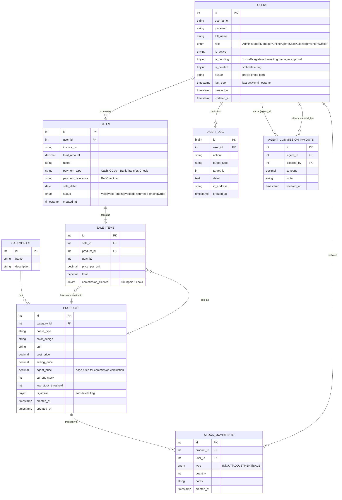
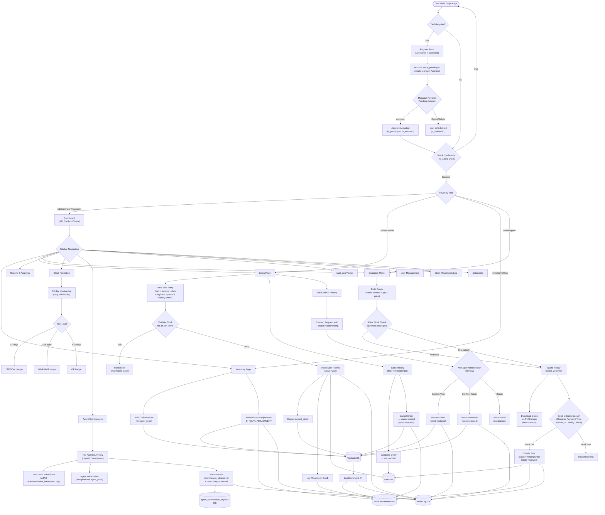
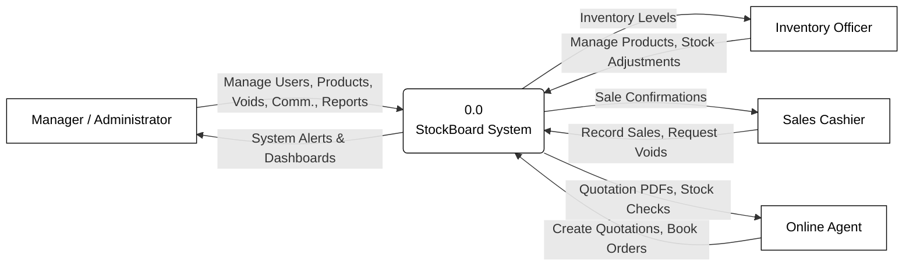
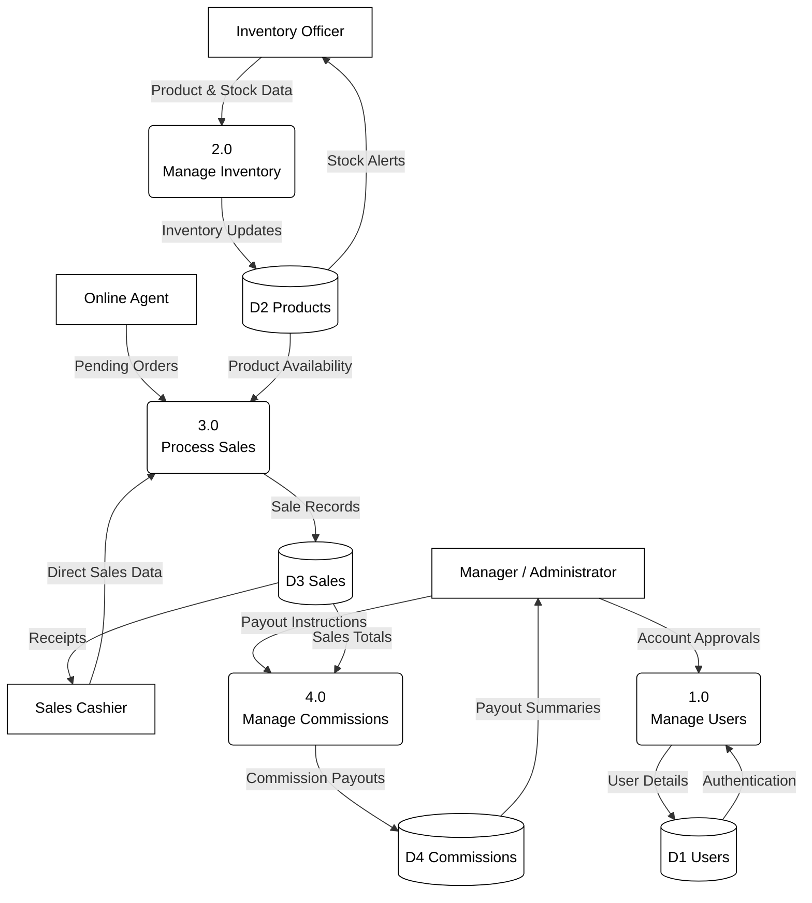
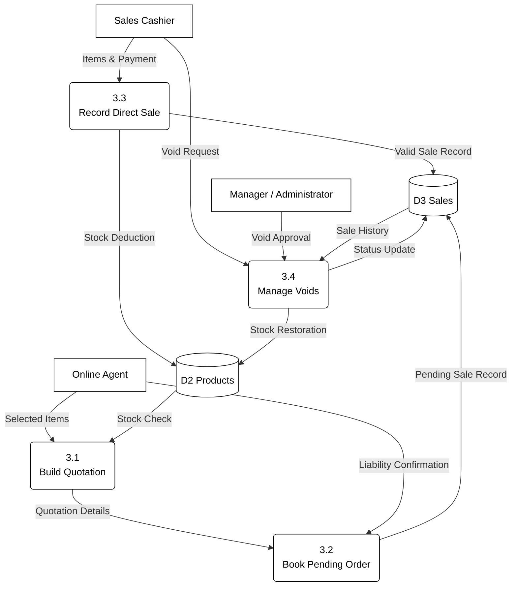

# StockBoard — System Diagrams v2

> Reflects all current features as of schema **v6.2** and the live codebase.
> Major additions vs. original: `agent_commission_payouts` table, `agent_price`/`is_pending`/`is_deleted`/`avatar`/`last_seen`/`commission_cleared`/`status` fields, 5-role RBAC, full sales-status lifecycle, Quotation → Sales Queue workflow, Stock Prediction module, and Commission Dashboard.

---

## 1 — Entity-Relationship Diagram

---

## 2 — Application Flowchart

---

## 3 — Data Flow Diagrams (Level 0 to 2)

### Level 0: Context Diagram

### Level 1: High-Level Subsystems

### Level 2: Sales & Orders Subsystem (Process 3.0)

---

## Key Changes from Original Diagrams

| Area | Original | Current (v2) |
|---|---|---|
| **Roles** | Generic string field | ENUM: `Administrator`, `Manager`, `OnlineAgent`, `SalesCashier`, `InventoryOfficer` |
| **Users table** | `is_active`, basic fields | + `is_pending`, `is_deleted`, `avatar`, `last_seen`, `updated_at` |
| **Products table** | `cost_price`, `selling_price`, `thickness`, `size` | + `agent_price`, `is_active`, `updated_at`; removed `thickness`/`size` |
| **Sales table** | No status field | + `status` ENUM (`Valid`, `VoidPending`, `Voided`, `Returned`, `PendingOrder`), `payment_type`, `payment_reference` |
| **Sale Items table** | Basic fields | + `commission_cleared` flag |
| **New table** | — | `agent_commission_payouts` (agent_id, cleared_by, amount, note) |
| **Quotation** | Not in original | Full Quotation Maker → Sales Queue booking workflow |
| **Void workflow** | Simple void | Request → Manager Approve (Void/Return) or Reject |
| **Commission module** | — | Full dashboard: per-agent summary, item breakdown, agent price editor, payout history |
| **Stock prediction** | — | 30-day moving average engine (Valid sales only, excludes Voided/Returned/Pending) |
| **Self-registration** | — | `is_pending` queue; Manager approves/rejects pending accounts |
| **Stock movement types** | `IN`, `OUT`, `ADJUSTMENT`, `SALE` | Same, but now explicit: `SALE` on direct sale, `OUT` on pending reservation, `IN` on cancel restore, `ADJUSTMENT` on void restore |
